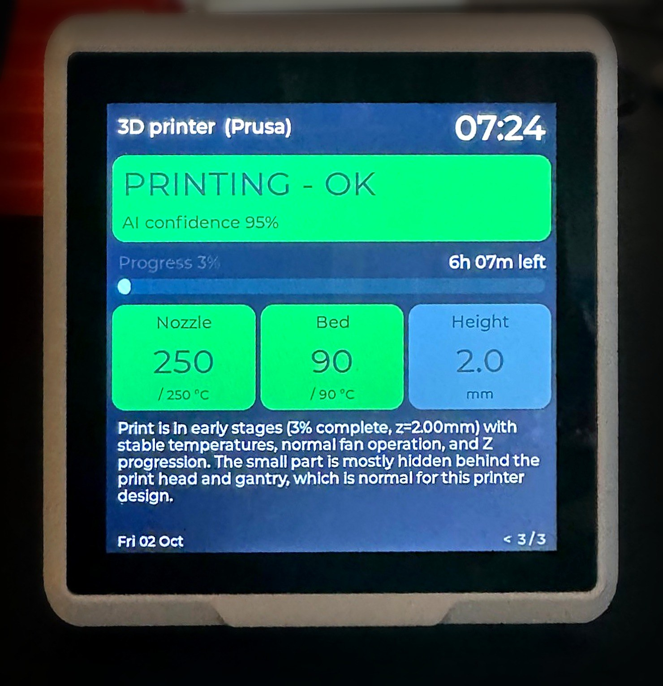
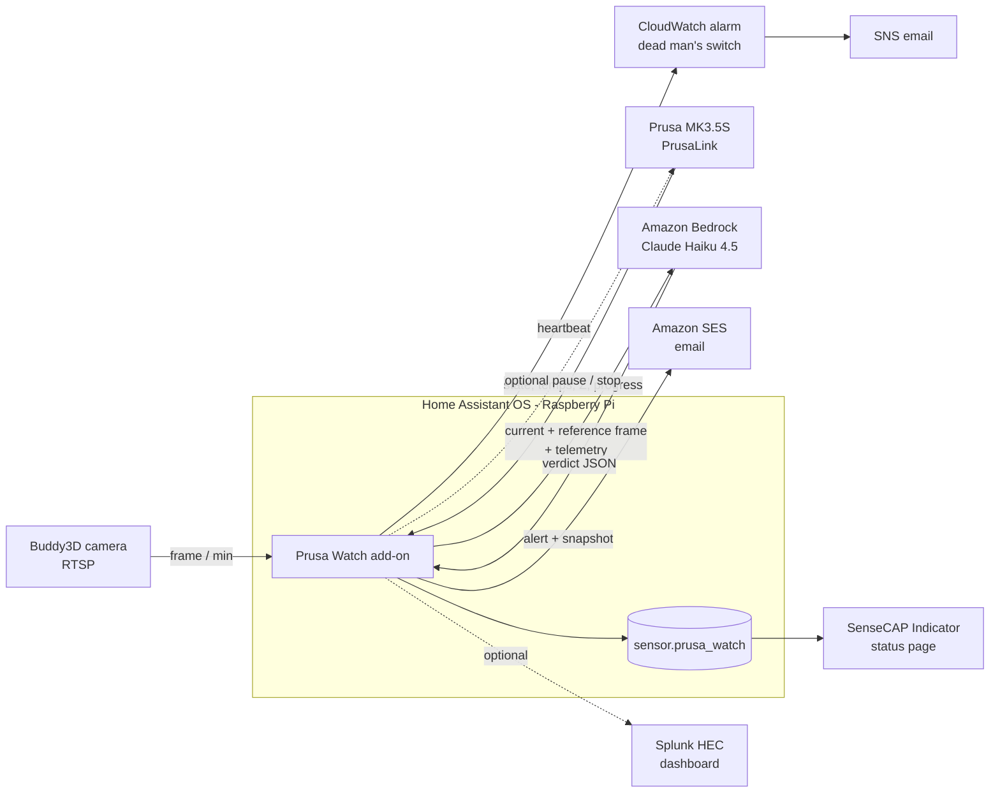

# Prusa Watch

**An AI print-failure watchdog for Prusa printers, running as a Home Assistant add-on.**
Every minute during a print it looks at the Buddy3D camera, reads the printer's telemetry, asks
**Claude Haiku 5.5** (Claude API) or Claude Haiku 4.5 on Amazon Bedrock whether the print is failing, and
emails you when it is. No extra hardware, no GPU: about **$0.03 per print-hour** with Haiku 5.5.

Built and tested on an Original Prusa **MK3.5S** with the **Buddy3D camera**, Home Assistant OS on a
Raspberry Pi 4, and a **SenseCAP Indicator D1** as a desk status display.

<p align="center">
  
  <br><sub>The SenseCAP Indicator status page during a PETG print - the text at the bottom is Claude's own description of the latest camera frame.</sub>
</p>



## What it does

- **Vision check every minute while printing.** Sends the current frame, a reference frame from ~5 minutes
  earlier and live telemetry to Claude. The model answers with a structured verdict:
  `ok / warning / failure / camera_problem`, the issue (spaghetti, clog/under-extrusion, detached part,
  blob on nozzle, layer shift, warping, stringing), confidence, how much of the part is visible, and the
  visual evidence.
- **Knows what it should be looking at:** the slicer thumbnail embedded in the G-code is sent along as an
  "expected" image, so a lattice sphere or a thin tower isn't mistaken for a defect (or vice versa).
- **Built to avoid false alarms:** an email only after 3 consecutive confident failures, every failure is
  re-checked on a second frame, and a guard rule refuses "detached part" unless the part is fully visible.
- **Printer-side events:** immediate email on PrusaLink `ERROR` / `ATTENTION` (runout, thermal, fan),
  camera unreachable, and "print finished" with a final photo.
- **Watching the watchdog:** a CloudWatch heartbeat alarm emails you if the add-on, the Pi or your internet
  goes silent; the add-on itself emails you if a print runs with no successful AI check for 10 minutes.
- **Only checks when there is something to see:** no AI calls while the printer heats up and levels the bed.
- **Self-check at startup:** the AI provider (key, model access) is verified when the add-on starts, so a
  wrong key is reported before a print, not during one.
- **Optional automatic pause/stop** via PrusaLink (off by default).
- **Energy and cost per print** from any smart plug with a power sensor (`power_entity`), plus an example
  automation that switches the plug off after the print once the hotend has cooled
  ([`ha/`](ha/prusa-power-off-after-print.yaml)).
- **Home Assistant entity** `sensor.prusa_watch` with verdict + telemetry attributes, latest frame in
  `/share/prusa_watch/latest.jpg`.
- **SenseCAP Indicator page** ([`sensecap/`](sensecap)) and an optional **Splunk app** ([`splunk_app/`](splunk_app))
  with a dashboard of verdicts, temperatures, confidence, cost and latency.

## Real numbers

From a 7-hour PETG print (lattice sphere), one check per minute:

| | Claude Haiku 4.5 (Bedrock, EU) | **Claude Haiku 5.5 (Claude API)** |
|---|---|---|
| Input / output per check | ~2,000 / ~120 tokens | ~2,600 / ~150 tokens (newer tokenizer) |
| Cost per check | ~$0.003 | **~$0.00045** |
| **Cost per print-hour** | ~$0.18 | **~$0.03** |
| Model latency | ~2 s | ~2 s |
| Frame grab (RTSP, ffmpeg on a Pi 4) | ~8 s | ~8 s |

### The false-alarm story

The first version produced confident `failure / detached_part` verdicts on a perfectly good print:
the MK3.5S is a **bed-slinger**, so between two frames the part moves around the image and is often hidden
behind the print head, and the model read that as "the part disappeared". The fix was a prompt that
explains the printer's motion and demands positive visual evidence, two extra answer fields
(`part_visible`, `evidence`), a deterministic guard rule and a second-frame confirmation.

Replaying the 33 frames the first version had flagged ([`eval/replay.py`](eval/replay.py)), all from a
print that succeeded:

| | old prompt | new prompt |
|---|---|---|
| `failure` | 4 | **0** |
| `warning` | 3 | **0** |
| `camera_problem` | 7 | 2 |
| **false alarms** | **14 / 33** | **2 / 33** |

The same 33 frames on the newer model (current prompt):

| | Haiku 4.5 (Bedrock) | **Haiku 5.5 (Claude API)** |
|---|---|---|
| false alarms | 2 / 33 | **0 / 33** |
| part judged *hidden* / *partly visible* | 24 / 6 | **4 / 29** |
| cost for the 33 frames | ~$0.10 | **$0.015** |

Haiku 4.5 mostly avoided false alarms by deciding it couldn't see the part; Haiku 5.5 actually recognises
the lattice part behind the print head and still judges it correctly - a much better basis for catching
real failures.

Known limitation: a dark part on the black bed in the camera's greyscale night mode is hard to see. Use
colour mode and some light in the enclosure. Detection of real failures needs more test data -
contributions of failure frames are very welcome.

## Requirements

- Prusa printer with **PrusaLink** (Buddy firmware 6.x: MK4/S, MK3.5/S, MINI, XL, CORE One).
- **Buddy3D camera** with RTSP enabled (or any RTSP / HTTP snapshot camera).
- **Home Assistant OS** (tested on a Raspberry Pi 4; `aarch64` and `amd64` images).
- A **Claude API key** ([console.anthropic.com](https://console.anthropic.com), recommended: Claude Haiku 5.5)
  *or* Amazon Bedrock access to Claude Haiku 4.5.
- An **AWS account** for email (SES) and the optional heartbeat alarm (CloudWatch).

## Setup

### 1. Printer and camera
1. Printer: *Settings → Network → PrusaLink* - enable it, note the IP and the **API key**.
2. Camera: [Prusa Connect](https://connect.prusa3d.com) → your printer → *Camera* → *Camera control* →
   **Streaming = RTSP**. The stream is `rtsp://<camera-ip>/live` (test it in VLC).
   If the image is upside down, set `camera_rotate: 180` - Connect's "Rotate camera" only affects its own UI.

### 2. Model and AWS
**Recommended - Claude API:** in [console.anthropic.com](https://console.anthropic.com) create a workspace
with a monthly spend limit and an API key; set `ai_provider: anthropic` and `anthropic_api_key`.

**Alternative - Amazon Bedrock** (keeps everything in one AWS region): *Bedrock → Model catalog →*
Anthropic **Claude Haiku 4.5** → submit the one-time use-case form; leave `ai_provider: bedrock`.

AWS is needed in both cases for email. Region used below: `eu-central-1`.
1. *(Bedrock only)* the model access above.
2. **SES** → *Identities* → verify the sender address (and, while in the SES sandbox, the recipient).
3. **IAM** → create a user (no console access) with the inline policy [`aws/iam-policy.json`](aws/iam-policy.json)
   (replace `ACCOUNT_ID` and `FROM_ADDRESS`), then create an access key. It can only invoke one model,
   send mail from one address and write one CloudWatch namespace.
4. **Heartbeat alarm** (recommended): `.\aws\heartbeat-alarm.ps1 -Email you@example.com` creates an SNS
   topic + email subscription and a CloudWatch alarm that fires when the heartbeat stops for 15 minutes.
5. Set a monthly **budget** alert ([`aws/budget.json`](aws/budget.json)).

### 3. Install the add-on
1. Home Assistant → *Settings → Apps (Add-ons) → App store* → ⋮ → **Repositories** →
   add `https://github.com/scostic/prusa-watch`.
2. Install **Prusa Watch** (the image builds on your device, ~5-10 minutes on a Pi 4).
3. Fill in the configuration (printer, camera, AWS key, emails), **Start**, and watch the *Log* tab.
   See [`prusa_watch/DOCS.md`](prusa_watch/DOCS.md) for every option.

### 4. Optional: smart plug (energy per print + power-off)
Any plug that gives Home Assistant a power sensor in **W** works (tested with a TP-Link **Tapo P110** via the
built-in *TP-Link Smart Home* integration).
1. Add the plug to Home Assistant and find its power sensor's **Entity ID**
   (*Settings → Entities → plug → ⚙️*), e.g. `sensor.<plug>_current_consumption`.
2. In the add-on configuration set `power_entity` to that ID and `energy_price` to your price per kWh.
   The add-on integrates power over the job itself (many plugs only offer "today's kWh", which resets at
   midnight), so it works for overnight prints.
3. Optional automation [`ha/prusa-power-off-after-print.yaml`](ha/prusa-power-off-after-print.yaml):
   switches the plug off 10 minutes after the print finished **and the nozzle is below 50 °C** - never
   while printing or paused. Replace `switch.printer_plug` with your plug's switch. Test it on a short
   print first.

> **Tapo plugs on newer firmware** may fail to add with *"Unsupported device … encrypt_type TPAP"*.
> In the Tapo app: *Me → Third-Party Services → Third-Party Compatibility* - switch it off and on, wait
> 30 seconds, then add the plug again.

### 5. Optional extras
- **SenseCAP Indicator D1** status page: [`sensecap/sensecap-prusa-watch.yaml`](sensecap/sensecap-prusa-watch.yaml)
  (ESPHome + LVGL). Coloured banner, progress bar, nozzle/bed/Z tiles and the AI description; jumps to
  full brightness on a failure.
- **Splunk**: create a HEC token for index `prusa_watch` / sourcetype `prusa:watch`, install
  [`splunk_app/prusa_watch`](splunk_app/prusa_watch) (index, field extraction, `cost_usd`, dashboard) and
  set `hec_url` / `hec_token`. Prefer an HTTPS HEC endpoint.
  [`aws/ses-smtp-for-splunk.ps1`](aws/ses-smtp-for-splunk.ps1) creates SES SMTP credentials if your Splunk
  server needs a mail relay.

## What you get in Home Assistant

`sensor.prusa_watch` - state is the latest verdict while printing (`ok`, `warning`, `failure`,
`camera_problem`) and otherwise the printer state (`idle`, `paused`, `attention`, `finished`, `offline`,
`camera_error`, `analysis_error`); `printing` with `phase: preheat` while the printer heats up.

| Attribute | |
|---|---|
| `issue`, `confidence`, `description`, `part_visible`, `streak`, `last_check` | the latest AI verdict |
| `printer_state`, `job_id`, `progress`, `time_remaining`, `axis_z` | from PrusaLink |
| `temp_nozzle`, `target_nozzle`, `temp_bed`, `target_bed` | temperatures (°C) |
| `power_w`, `print_energy_kwh`, `print_energy_cost` | with a smart plug (`power_entity`) |

Plus `/share/prusa_watch/latest.jpg` (latest frame) and `flagged-*.jpg` (warnings and failures).

| Email | When |
|---|---|
| Possible failure / PAUSED / STOPPED | 3 consecutive confirmed failure verdicts (cooldown 30 min) |
| Printer needs attention | PrusaLink reports `ERROR` or `ATTENTION` (runout, thermal, fan) |
| Camera unreachable | 5 failed frame grabs in a row during a print |
| Watchdog is BLIND | printing, but no successful AI check for 10 minutes (timer starts after preheat) |
| AI provider not working | the startup self-check fails: wrong API key, no model access, unknown model |
| Print finished | with the final photo and, with a plug, energy and cost |
| CloudWatch ALARM / OK (SNS) | the add-on's heartbeat stopped / came back |

## Measuring detection: the labelled test set

False alarms are easy to measure; missed failures are not. Prusa Watch therefore keeps a labelled test set:

1. Every warning/failure check - and 1 in 10 normal checks - is saved to `/share/prusa_watch/dataset/`
   with both frames, the exact context the model saw and its verdict.
2. Label them in the **Prusa Watch** panel in the Home Assistant sidebar (✅ OK print / ❌ Real failure + issue),
   or with three button helpers on a dashboard: *Correct* and *False alarm* label the latest alert,
   *Missed failure* saves the current frame as a real failure the model didn't catch.
3. Copy the folder to your PC and measure:
   ```bash
   PYTHONPATH=prusa_watch/app python eval/replay.py --dataset eval/dataset --variants recorded,v2
   ```
   `recorded` scores what the live model said (free); `v2`/`v1` re-run the current/original prompt.
   Output: confusion matrix, **recall (failures caught)**, precision, false-alarm rate, recall per issue.

## Develop and test locally

```bash
python -m venv .venv
.venv/bin/pip install -r prusa_watch/requirements.txt
cp config.local.example.json config.local.json      # fill in your values
PYTHONPATH=prusa_watch/app .venv/bin/python -m prusa_watch --config config.local.json --once --dry-run
python -m unittest discover -s tests
```
`--dry-run` never emails and never touches the printer. Needs `ffmpeg` on `PATH`.
`eval/replay.py` replays saved frames through two prompt versions and prints a comparison.

## Troubleshooting

| Log line / symptom | What to do |
|---|---|
| `AI provider check FAILED (...): invalid API key / credentials (401)` | paste the API key again (Claude API key, or the AWS key for Bedrock) |
| `... no access to this model (403)` / `model not found (404)` | check the model id and that your account/workspace can use it |
| `PrusaLink unreachable: 401` | wrong `prusalink_api_key` (or use `prusalink_password` with user `maker`) |
| `Camera grab failed` | enable RTSP in Prusa Connect (*Camera → Streaming = RTSP*), restart the camera |
| `Job N has no G-code thumbnail` | enable thumbnails in PrusaSlicer (*Printer Settings → G-code thumbnails*, e.g. `440x240/QOI`) |
| Image upside down / sideways | `camera_rotate: 180` (or 90/270) |
| Home Assistant: "Local and store versions differ" | *Check for updates*, refresh, then **Update** (not Rebuild) |
| Tapo plug: "Unsupported device ... TPAP" | Tapo app → Third-Party Compatibility off/on, wait 30 s, add again |

## Safety

Prusa Watch is a convenience monitor, **not a safety device**. It can miss failures and it can raise false
alarms. Keep `auto_action: none` until you have watched several prints and tested a deliberate failure, and
never leave a printer unattended where that would be unsafe.

## Roadmap ideas
- Start checks at a minimum progress (skip bed levelling), crop to the bed region, first-layer check.
- Better pictures at night: an LED strip on the printer's GPIO board, switched from start/end G-code.
- Home Assistant actionable notifications (pause from your phone).
- Timelapse per print from the saved frames.
- A small collection of real failure frames to measure detection, not just false alarms.

## License
[MIT](LICENSE)
